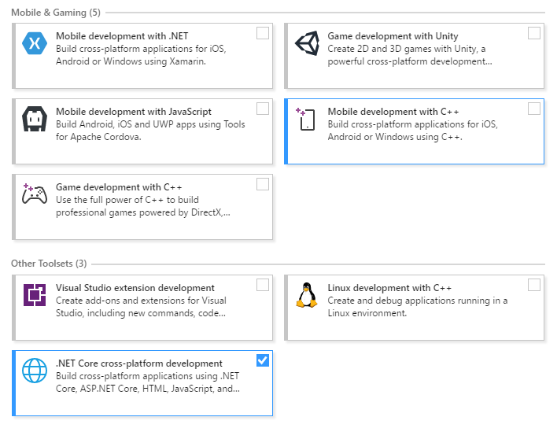
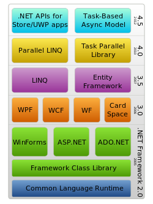
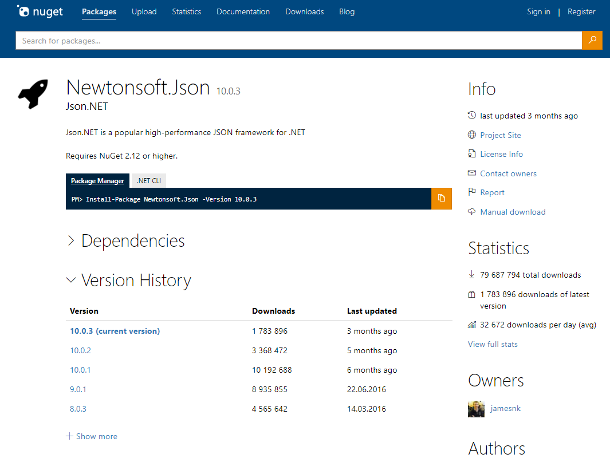

# Курс .NET

- 1 [.NET](#net)
  - [IDE](#ide)
  - [.NET Framework](#net-framework)
    - [CLR](#clr)
  - [.NET Core](#net-core)
  - [.NET Standard](#net-standard)
  - [.NET Native](#net-native)
  - [Nuget](#nuget)
- 2 Типы данных, значимые типы
  - Ссылочные / значимые типы
  - System.Object
  - Базовые типы, enum, decimal, datetime, timespan
  - Struct
  - Базовые операции и операторы
- 3 Классы
  - Конструкторы
  - Модификаторы доступа
  - Модификаторы типов: static, abstract, partial, sealed
  - Наследование, полиморфизм, интерфейсы
  - Перегрузка методов, операторов
  - Аттрибуты
  - Generic типы и методы, constraint
  - Анонимные типы, dynamic
  - Extension methods
  - Сборка мусора:
    - Алгоритм, GC
    - Финализаторы
    - Внешние ресурсы, IDisposable pattern
- 4 Строки
  - Символы и строки
  - Создание, преобразование строк. Класс StringBuilder
  - Кодировки, преобразование строк в байт
- 5 Управление программой
  - Циклы, IEnumerable, yield
  - Условные операторы
- 6 Коллекции
  - Типы коллекций и различия между ними
- 7 Делегаты и события
  - Делегаты и обобщенные делегаты, лямбда выражения
  - События
  - Замыкания
- 8 LINQ
  - Отложенные и неотложенные запросы
  - Стандартный и Query Expressions синтакис запросов
- 9 Обработка ошибок
  - Exception
  - throw / try / catch / finally
  - Debug / Trace
- 10 Reflection
- 11 Многопоточность и ассинхронность
  - Проблемы многопоточности
  - Примитивы синхронизации
  - Thread / Threadpool
  - TPL. Класс Task, Continuation, Cancellation
  - async / await, SyncronizationContext
- 12 Сериализация данных
  - JSON
  - XML
- 13 Ввод / вывод
  - Потоки
  - Чтение и запись текстовой информации
  - Работа с файловой системой. System.IO
- 14 Работа с базами данных
  - ADO.Net
  - Entity Framework
  - Simple mapper: dapper, linq2db
- 15 Принципы и паттерны проектирования
  - SOLID
  - Связь классов: наследование, ассоциация, композиция, агрегация
  - Dependency Injection, IOC, управление зависимостями
  - Тестируемость приложения, unit-test, Moq
  - Паттерны: Singleton, Factory, Strategy, Facade, Repository
- 16 Работа в web
  - Http в .Net, класс HttpClient
  - ASP.Net MVC Core

## .Net

### Литература

- [.NET Documentation](https://docs.microsoft.com/en-us/dotnet/)
- Jeffrey Richter, CLR Via C# (4th edition)
- Jon Skeet, C# in Depth
- Andrew Troelsen, C# 6.0 and the .NET 4.6 Framework (Саый низкий порог вхождения в изучение C#)
- Сергей Тепляков, [Набор доступных статей про принципам проектирования](http://sergeyteplyakov.blogspot.ru/2013/10/articles.html), книга "Паттерны проектирования на платформе .NET"

### Использование и применение

- Высокоуровневый ооп язык
- Строгая типизация
- Автоматическое управление памятью

Плюсы:

- Синтаксис и возможности
- Быстрое развитие
- IDE
- Отсутствие проблем с версиями (DLL хелл)

Минусы:

- До .Net Core сильнейшая привязка к Windows
- Бардак с большим количеством фреймворков, которые живут одновременно
- Высочайшая скорость разработки новых фреймворков

[Java vs C# Stackoverflow](https://stackoverflow.com/questions/610199/the-art-of-programming-java-vs-c-sharp)

#### Применение

- ServerSide
- GameDev (Unity, ServerSide, etc)
- UWP / WPF / WinForms Application

### История версий

| C#                             | C# 1.0  | C# 2.0                                   | C# 3.0                                   | C# 4.0                                  | C# 5.0  | C# 6.0                 | C# 7.0                 |
| ------------------------------ | ------- | ---------------------------------------- | ---------------------------------------- | --------------------------------------- | ------- | ---------------------- | ---------------------- |
| [.NET&nbsp;Framework][NETFRWK] | 1.0/1.1 | 2.0                                      | 3.0/3.5                                  | 4.0                                     | 4.5     | 4.5/4.6                | 4.5-[4.7][Net47]       |
| Visual&nbsp;Studio             | 2002    | 2005                                     | 2008                                     | 2010                                    | 2012/13 | 2013/2015              | 2017                   |
| [Net Core][NetCore]            | -       | -                                        | -                                        | -                                       | -       | 1.0                    | 1.1/2.0                |
| Features                       | Basic   | Generics Partial Nullable Properties Static Delegates | AnonymousTypes Extensions QueryExp Lambda | dynamic OptionalArgs Generic covariance | Async   | [C# 6.0 New][C#6.0New] | [C# 7.0 New][C#7.0New] |

[NetCore]:https://www.microsoft.com/net/
[NETFRWK]:https://www.microsoft.com/net/download/framework
[C#6.0New]:https://msdn.microsoft.com/ru-ru/magazine/dn879355.aspx
[C#7.0New]:https://blogs.msdn.microsoft.com/dotnet/2017/03/09/new-features-in-c-7-0/
[Net47]:https://blogs.msdn.microsoft.com/dotnet/2017/04/05/announcing-the-net-framework-4-7/

- [.NET Framework Guide](https://docs.microsoft.com/en-us/dotnet/framework/)
- [.NET Core Roadmap & Supported Platforms](https://github.com/dotnet/core/blob/master/roadmap.md)
- [C#7.0 with .Net Framework 4.0/4.5](https://stackoverflow.com/questions/42482520/does-c-sharp-7-0-work-for-net-4-5)

### IDE

- [Visual Studio 2017](https://www.visualstudio.com/ru/vs/) + [Resharper](https://www.jetbrains.com/resharper/)
- [Visual Studio Code](https://code.visualstudio.com)
- [Visual Studio for Mac](https://www.visualstudio.com/ru/vs/visual-studio-mac/) (до этого - Xamarin)
- [JetBrains Rider](https://www.jetbrains.com/rider/)
- MonoDevelop, SharpDevelop, etc

[Установка студии](https://docs.microsoft.com/en-us/visualstudio/install/install-visual-studio) отличается красивым выбором Workloads:

### .NET Framework

Код собирается в промежуточный байт-код CIL ([Common Intermediate Language](en.wikipedia.org/wiki/Common_Intermediate_Language)) который именуется сборкой (assembly)

Microsoft заложила возможность мультиплатформенности - стандарт CLI ([Common Language Infrastructure](https://en.wikipedia.org/wiki/Common_Language_Infrastructure)), но по факту получился windows-only.

Сейчас .NET Framework постепенно становится legacy.

### CLR

[CLR](https://docs.microsoft.com/en-us/dotnet/standard/clr) - исполняющая среда для CIL. JIT компилятор - часть CLR.

.Net совместимые языки: C#, F#, C++/CLI (legacy name "Managed C++"), VB.Net

Managed Code - код, который может запускаться только из-под CLR/Mono/etc

Stroustrup: "On the difficult and controversial question of what the CLI binding/extensions to C++ is to be called, I prefer C++/CLI as a shorthand for "The CLI extensions to ISO C++". Keeping C++ as part of the name reminds people what is the base language and will help keep C++ a proper subset of C++ with the C++/CLI extensions."

### .Net Core

CLR -> [CoreCLR](https://github.com/dotnet/coreclr), включает новый JIT компилятор [RyuJIT](https://github.com/dotnet/coreclr/blob/master/Documentation/botr/ryujit-overview.md), GC, etc

FCL -> .NET Core Libraries ([CoreFx](https://github.com/dotnet/corefx)): System.Collections, System.IO, System.Xml, etc

Удалили много лишнего (WebForms, WinForms, WPF, WCF, EF) по сравнению с .NET Framework, сделали код OpenSource, ускорили.

Отдельные классы из старого фреймворка выложили отдельными нагетами.

MS не стремится сделать вес фреймворка меньше, а хочет, чтобы не было лишних зависимостей

- .NET Framework 4.6 - 200 MB 
- .NET Core 1.0 - 11 MB
- .NET Core 2.0 - 112 MB

### .NET Standard

Microsoft управляет тремя .NET фреймворками: .NET Framework, .NET Core, Xamarin

Standard позволяет использовать код на всех трех и переносить между ними. 

Не полностью покрывает код Framework.

Версия [.NET Standard 2.0](https://blogs.msdn.microsoft.com/dotnet/2017/08/14/announcing-net-standard-2-0/) поддерживает:

- .NET Framework 4.6.1
- .NET Core 2.0
- Mono 5.4
- Xamarin.iOS 10.14, Xamarin.Mac 3.8, Xamarin.Android 7.5
- Upcoming version of UWP (expected to ship later this year)

### .NET Native

[Технология](https://docs.microsoft.com/en-us/dotnet/framework/net-native/) компиляции в нативный код ahead-of-time. 
Раньше для этого использовался [ngen][ngen-link], но у них есть существенные [отличия][native-comp] (не использует CLR и JIT вообще, вместо него обрезанный, отрефакторенный runtime).

[ngen-link]:https://docs.microsoft.com/en-us/dotnet/framework/tools/ngen-exe-native-image-generator
[native-comp]:https://docs.microsoft.com/en-us/dotnet/framework/net-native/net-native-and-compilation
Ускоряет первый запуск программы.

Проблемы с рефлекшеном: все машинные коды должны быть сгенерированы заранее, эвристика компилятора не может угадать все возможные сценарии метапрограммирования.

Не работает в .net core 2.0.

### Nuget

Система публикации сборок.

